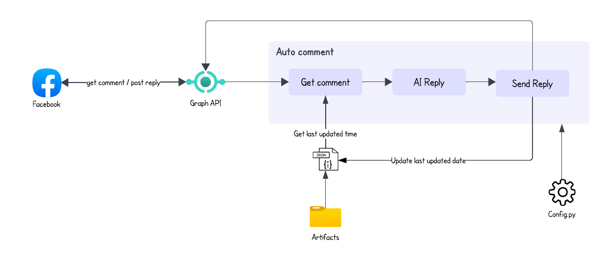

# Facebook Comment Bot 🤖


## Installation
### 1. Clone github repo
```
https://github.com/lintosunny/facebook-comment-bot.git
```

### 2. Set up virtual environment
```
python<vesrion> -m venv <virtual-env-name>
```

### 3. Activate virtual environment
```
.\<virtual-env-name>\Scripts\Activate
```

### 4. Install dependencies
```
pip install -r requirements.txt
```

### 5. Set up environment variables
Create ```.env``` file in the root folder and add your facebook and gemini api credentials:
```
FACEBOOK_ACCESS_TOKEN = <your-facebook-access-token>
GEMINI_API_KEY = <your-gemini-api-key>
PAGE_ID = <your-facebook-page-id>
```