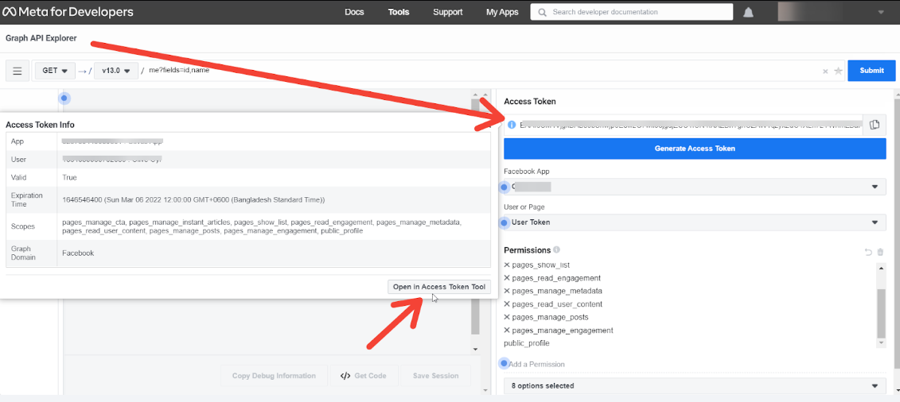

# Facebook Comment Bot 🤖

Facebook comment bot is an automated system that responds to comments on your Facebook page posts using Google's Gemini AI. It helps businesses engage with their audience, provide quick responses, and maintain a consistent brand voice.  
  
- **Generates AI-driven replies** based on a predefined prompt  
- **Filters** inappropriate or irrelevant comments  
- **Logs** interactions for monitoring and improvements  


## Demo
[](https://www.youtube.com/watch?v=4py3INBWTow)

## Installation
### 1. Clone github repo
```
https://github.com/lintosunny/facebook-comment-bot.git
```

### 2. Set up virtual environment
```
python<vesrion> -m venv <virtual-env-name>
```

### 3. Activate virtual environment
```
.\<virtual-env-name>\Scripts\Activate
```

### 4. Install dependencies
```
pip install -r requirements.txt
```

### 5. Set up environment variables
Create ```.env``` file in the root folder and add your facebook and gemini api credentials:
```
FACEBOOK_ACCESS_TOKEN = <your-facebook-access-token>
GEMINI_API_KEY = <your-gemini-api-key>
PAGE_ID = <your-facebook-page-id>
```

### 6. Update artifacts
Update the date in ```./artifacts/last_updated.json```. If you want to reply comments posted from yesterday, change date to yesterday's.
After a successful run, the system will automatically update the date to the current timestamp. Ensure the datetime format remains as ```YYYY-MM-DDTHH:MM:SS+0000```
```
{"last_updated_str": "<your-desired-datetime>"}
```

### 7. Update prompt
Update the prompt in ```./src/config/prompt.yaml``` as per your use case.
```
prompt_template: |
 <your-prompt>
```

### 8. Run locally
Run the script on your command prompt
```
python main.py
```

## Reference
### 1. How to get Gemini API Key for free
Sign into Google AI Studio > Get API Key > Create API key > Select one Google cloud project > Create API Key in existing project > Copy API key
```
https://aistudio.google.com/welcome
```

### 2. How to get Facebook Access Token
Sign into Meta for developers > My apps > Create app > Tools > Graph API Explorer > Generate Access token
```
https://developers.facebook.com/
```
Select appropriate meta app and user or page before generating access token.  
Permissions Required:
```
pages_show_list
business_management
pages_read_engagement
pages_manage_metadata
pages_read_user_content
pages_manage_posts
pages_manage_engagement
```

### 3. How to extend Facebook Access Token
Once you have successfully generated Facebook Page Access Token from ```Graph API Explorer```, click on ```Info icon``` from the ‘Access Token’ field. Then, simply go ahead and hit the ```Open in Access Token Tool``` button.

You will be redirected to the ‘Access Token Info’ page. Right at the bottom, you will find the option to ```Extend Access Token```. Simply go ahead and hit the button.

### 4. How to get facebook page id
In Graph API Explorer select name and id in fields. Press submit.

### 5. How to write an effective prompt  
An OpenAI co-founder, and currently the organization’s president, Brockman is an ideal expert to offer such advice. Helpfully, he recently took to X (formerly Twitter) to share the basic structure of the perfect AI prompt. Originally developed by engineer and AI company founder Ben Hylak, this formula breaks down the ideal AI prompt into four sections. 
#### Define Your Goal  
Clearly state what you want AI to generate. Be specific for better results.  
*Example: "List of the best medium-length hikes within two hours of San Francisco, focusing on unique and lesser-known trails."* 

#### Specify Output Format  
Define how you want the response structured.  
*Example: "Provide hike name (as found on AllTrails), start & end address, distance, drive time, duration, and what makes it unique."*

#### Set Constraints & Warnings  
Prevent AI hallucinations by setting guidelines.  
*Example: "Ensure the trail name is correct, exists, and time estimates are accurate."*  

### Provide Context  
Give additional background to improve relevance.  
*Example: "We are experienced hikers, have done all common trails, loved Mt. Tam for the breakfast at the end, and prefer ocean views."*

#### 💡 Key Takeaways  
- More details = better responses.  
- Think of AI as a human—it works best when you communicate naturally.  
- Experiment with AI tools to refine your prompting skills. 
